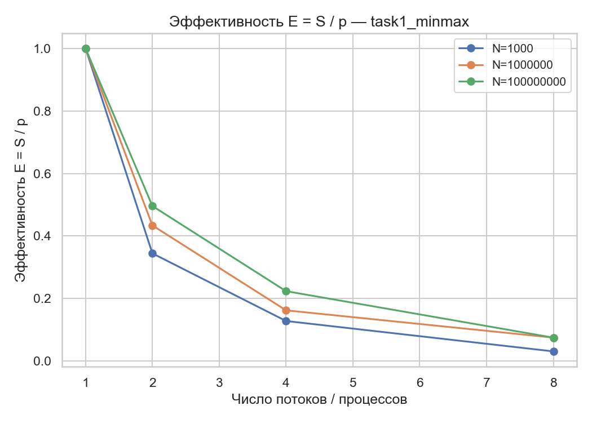

# HPC-tasks
Лабораторные задания по курсу «Введение в суперкомпьютерные вычисления»

Исследование производительности параллельных вычислений (OpenMP и MPI)

## 🎯 Цель работы

Целью лабораторной работы является исследование масштабируемости и эффективности параллельных вычислений с использованием двух технологий: 

   * OpenMP — для распараллеливания вычислений на уровне потоков
   * MPI — для распределённых вычислений между процессами.

Основная задача — экспериментально оценить:

   * ускорение вычислений (Speedup, S = T₁ / Tₚ)
   * эффективность параллелизации (Efficiency, E = S / p)
   * влияние размера задачи и количества потоков/процессов на производительность.

## 🧩 Структура проекта

```HPC-tasks/
│
├── OpenMP/
│   ├── src/                # Исходники задач на C++ (OpenMP)
│   ├── include/            # Заголовочные файлы
│   ├── results/            # CSV-файлы с результатами экспериментов
│   ├── config.json         # Конфигурация тестов (размеры, потоки, повторы)
│   └── Makefile            # Сборка и запуск OpenMP
│
├── MPI/
│   ├── src/                # Исходники задач на Python (MPI)
│   ├── tasks/              # Реализация задач
│   ├── results/            # CSV-файлы с результатами MPI
│   ├── config.json         # Конфигурация MPI-задач
│   └── run_mpi_tasks.py    # Менеджер запуска MPI-тестов
│
├── plot_all_results.py     # Универсальный скрипт для построения графиков
└── README.md               # Текущий файл
```

Результаты сохраняются в соответствующие CSV-файлы (results/taskX_*.csv),
после чего графики можно построить с помощью:

```python3 plot_all_results.py```

## 📊 Задачи и результаты
### 🧠 Задача 1 — Нахождение минимума/максимума массива


Необходимо найти минимальное и максимальное значение в массиве случайных чисел.
Распараллеливание производится по блокам данных.

При небольших размерах массива (N = 10³, 10⁵) выигрыш минимален из-за накладных расходов на создание потоков.
При увеличении N до 10⁷–10⁹ параллелизация даёт ускорение, однако эффективность падает с ростом числа потоков из-за синхронизации при редукции (операция min/max требует сравнения всех элементов).

Графики:
 


Время выполнения растёт почти линейно с увеличением размера задачи.
Ускорение достигает пика при 4–8 потоках, затем выходит на плато.
Эффективность падает по мере роста потоков, что указывает на saturating scaling.
